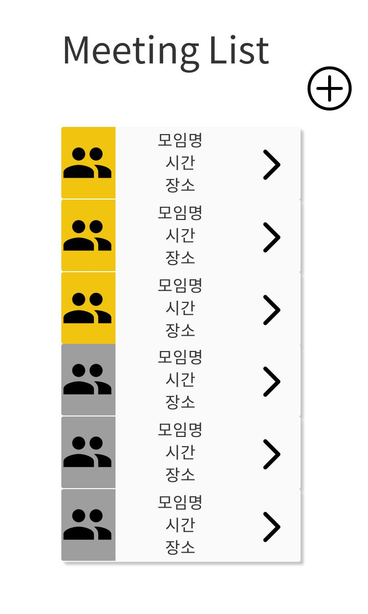
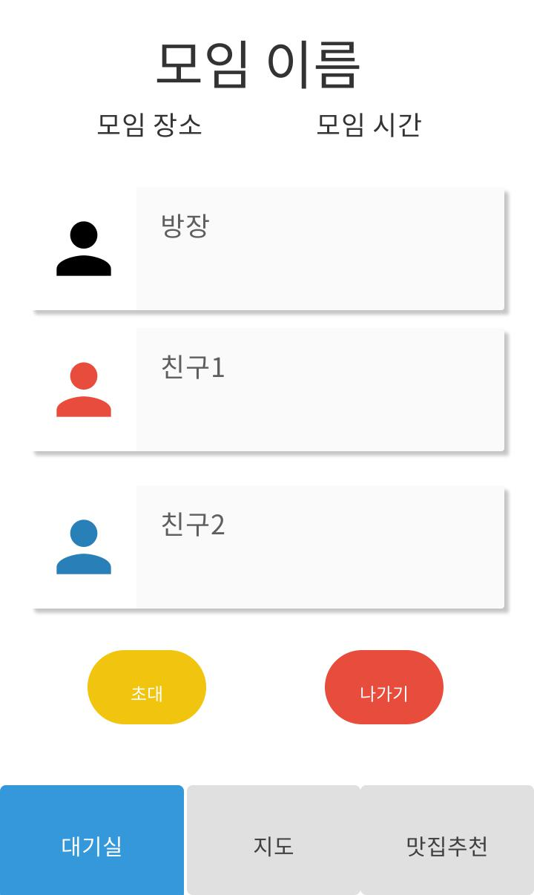
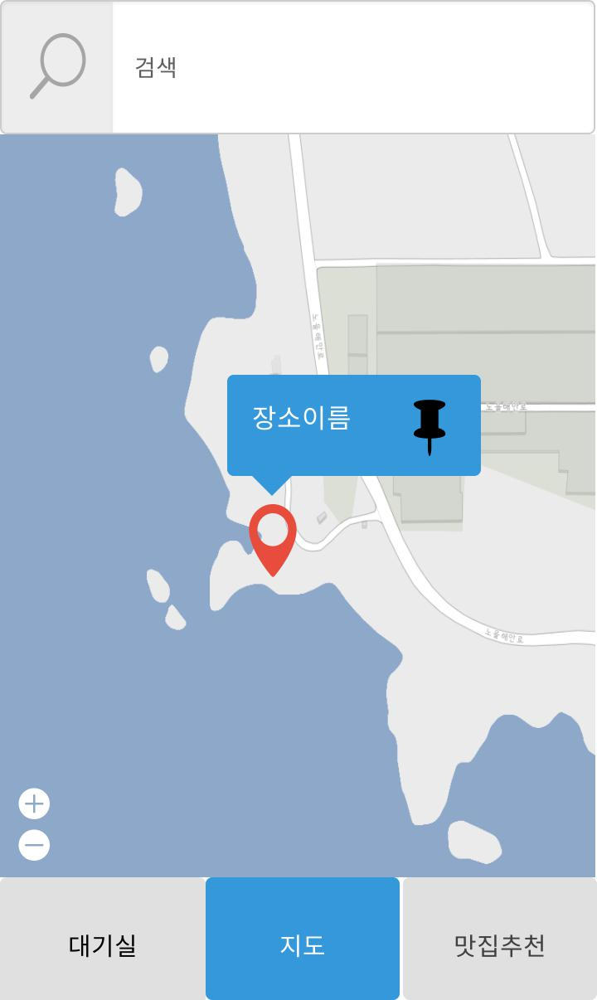
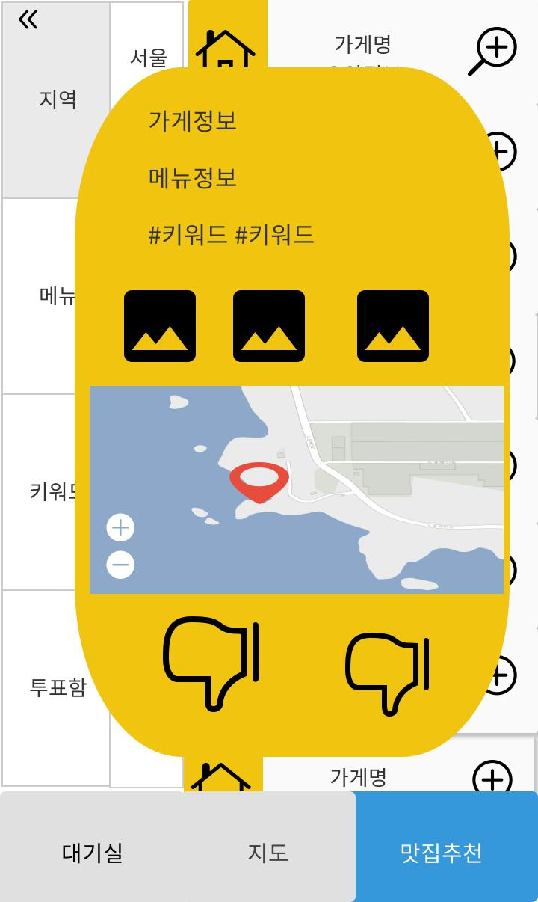

# MGMG

## Service

- 사용자 선택 키워드 기반 맛집 추천 어플리케이션
- 식사모임 관리

## Stack

- Android
- Firebase
- Spring boot
- Python
- Bigdata
- MongoDB
- GIT
- AWS
- JIRA
- Docker
- Jenkins
- konlpy
- Wordcloud

## Team

- 황호민 [팀장/백엔드]
- 이상호 [팀원/안드로이드]
- 공필상 [팀원/안드로이드]
- 박진용 [팀원/안드로이드]

## Wireframe

